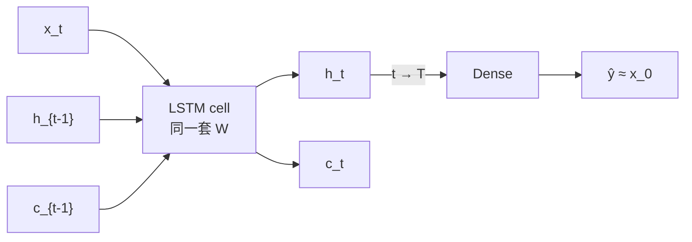

# LSTM：门控如何管住长依赖

> 状态：published · 轨道：Classic DL · 难度：L2 · 语言：C++

## 要解决什么问题

Vanilla RNN 只有一条会被反复改写的 \(h\)；信息要跨很多步时容易糊掉。LSTM 怎样用**门控 + 慢通道 \(c\)** 把早期信号留到末尾？

## 直觉

多一条细胞状态 \(c\)（慢车道），再用三个门决定这一步：

| 门 | 作用 |
|----|------|
| forget \(f\) | \(c\) 里旧记忆留多少 |
| input \(i\) | 新候选写进 \(c\) 多少 |
| output \(o\) | 从 \(c\) 读出多少变成 \(h\) |

## 本主题在训什么

| | 说明 |
|--|------|
| 数据 | **合成 delayed recall**（程序内生成，无下载） |
| 任务 | 记住二进制 \(x_0\in\{0,1\}\)，中间噪声，末步 query 时输出该位 |
| 输入 | \([\text{value},\ \text{query}]\)，仅最后一步 `query=1` |
| 网络 | 共享 LSTM cell → Dense(1)；同超参对照 Vanilla RNN |
| 损失 | MSE；日志打 MAE 与 accuracy（阈值 0.5） |

## 网络长什么样

\[
\begin{aligned}
f_t,i_t,o_t &= \sigma(\cdot),\quad g_t=\tanh(\cdot)\\
c_t &= f_t\odot c_{t-1}+i_t\odot g_t\\
h_t &= o_t\odot\tanh(c_t)
\end{aligned}
\]



## 目录

```
lstm-seq/
├── README.md / notes.md / video.md / meta.yaml
└── code/
    ├── lstm/    # LstmCell · LstmNet
    └── demos/   # gates · recall
```

细节见 [notes.md](./notes.md)。

## 例子

| Demo | 你在看什么 |
|------|------------|
| `gates`（默认） | 权重固定，打印每步 \(f,i,o,c_t,h_t\) |
| `recall` | 延迟回忆上训 LSTM（对照基线与 Vanilla RNN） |

```bash
make run-lstm                 # gates
make run-lstm DEMO=recall     # 合成数据，无下载
```

预期：`recall` 里 LSTM 测试准确率 \(\ge 95\%\)（基线约 50%）。短 \(T\) 上 Vanilla RNN 也可能 latch；门控机制看 `gates`，更长依赖看 Attention。

## 局限与下一步

- 不覆盖：GRU 深讲、公开时序刷分、字符级 LM
- 前置：[RNN 序列](../rnn-seq/)
- 下一站：[Seq2Seq](../seq2seq-basics/) → [Attention](../../02-transformers/attention-basics/)
