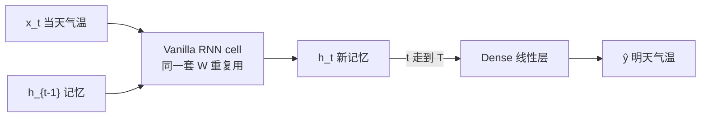
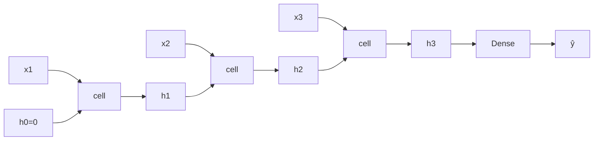
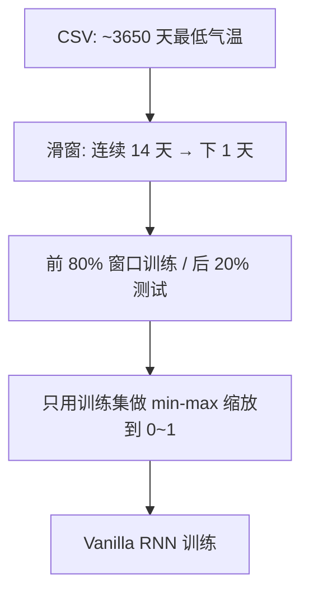

# RNN 序列：状态如何沿时间传递

> 状态：published · 轨道：Classic DL · 难度：L2 · 语言：C++

## 要解决什么问题

输入是一串有先后顺序的数（这里是每天最低气温）时，模型怎么边读边记，再预测明天？

## 直觉

维护一个会更新的小向量 \(h\)（隐藏状态）：

1. 读入当天气温 \(x_t\)
2. 结合上一步记忆 \(h_{t-1}\)，算出新记忆 \(h_t\)
3. 读完窗口后，用最后的 \(h_T\) 预测明天

每一步用的是**同一套权重**（Vanilla RNN）。

## 本主题在训什么

| | 说明 |
|--|------|
| 数据 | [Daily Min Temperatures](https://github.com/jbrownlee/Datasets)（墨尔本 1981–1990 日最低气温，约 3650 点） |
| 任务 | 用过去 **14 天** 预测 **明天** 最低气温（°C） |
| 网络 | Vanilla RNN（共享单元）→ 一层线性输出 |
| 损失 | 归一化后的 MSE；日志里同时打原始尺度的 MAE（°C） |

## 网络长什么样

折叠起来看（实现里就是这个）：



按时间展开（`lookback = 14`，图里只画 3 步示意）：



每一步的公式：

\[
h_t = \tanh(x_t W_{xh} + h_{t-1} W_{hh} + b),\quad
\hat{y} = h_T W_{\text{out}} + b_{\text{out}}
\]

`c1 / c2 / c3` 画了三次，**权重是同一份**——这就是「沿时间共享」。

## 数据怎么切



首次运行会下载到 `topics/01-classic-dl/rnn-seq/data/daily-min-temperatures.csv`。

## 目录

```
rnn-seq/
├── README.md / notes.md / video.md / meta.yaml
└── code/
    ├── rnn/     # RnnCell（逐步更新）· VanillaRnn（接预测头）
    └── demos/   # unroll · temp
```

实现细节见 [notes.md](./notes.md)。

## 例子

| Demo | 你在看什么 |
|------|------------|
| `unroll`（默认） | 权重固定，打印每一步 \(h_t\)——先建立「记忆在变」的直觉 |
| `temp` | 真实日气温序列上训 Vanilla RNN，看测试 MAE（°C） |

```bash
make run-rnn               # unroll
make run-rnn DEMO=temp     # 首次若无缓存会下载 CSV
```

预期：`temp` 的测试 MAE 应好于「用昨天当预测」的朴素基线（程序末尾会对比）。

## 局限与下一步

- 不覆盖：多变量气象、刷 SOTA
- 序列更长 / 依赖更远时，朴素 RNN 容易吃力 → [LSTM](../lstm-seq/) → [Seq2Seq](../seq2seq-basics/) → [Attention](../../02-transformers/attention-basics/)
