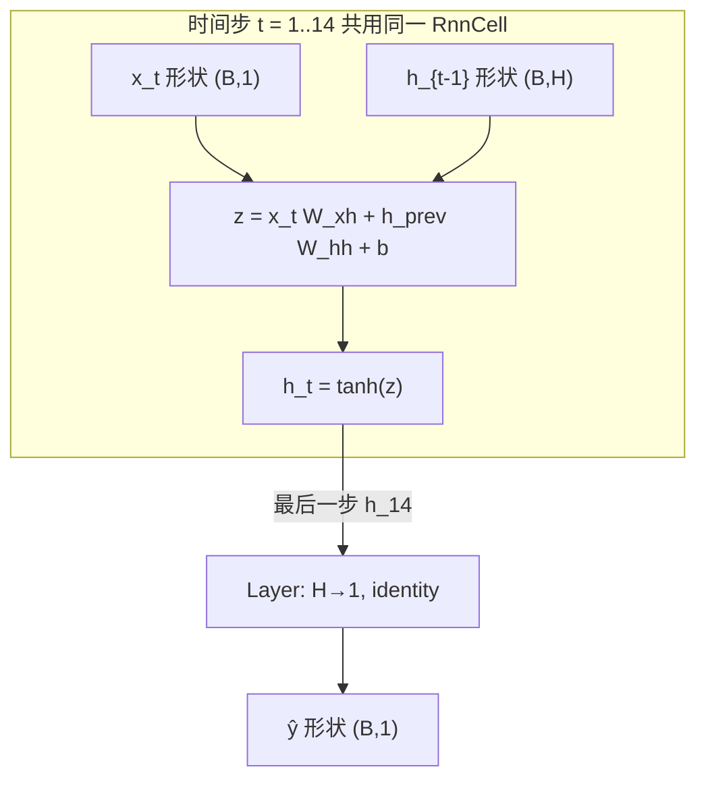

# RNN 序列设计文档

纯 C++ 手写 **Vanilla RNN**，用墨尔本日最低气温做下一步预测。

## 1. 一句话对照

| 问题 | 答案 |
|------|------|
| 用什么网络？ | Vanilla RNN + 一层线性头（identity） |
| 什么数据？ | Daily Min Temperatures，约 3650 天 |
| 训练目标？ | 过去 14 天 → 预测明天最低气温；MSE（0~1 归一化空间） |

## 2. 目录

```
topics/01-classic-dl/rnn-seq/
├── README.md / notes.md / video.md / meta.yaml
└── code/
    ├── main.cpp
    ├── rnn/
    │   ├── cell.*   # 每步: h_t = tanh(x_t W_xh + h_{t-1} W_hh + b)
    │   └── net.*    # VanillaRnn: 扫完窗口 → Dense(1)
    └── demos/
        ├── unroll.* # 固定权重，打印 h_t
        └── temp.*   # 下载 CSV、滑窗、训练
```

数据缓存：`topics/01-classic-dl/rnn-seq/data/`（`RNN_DATA_DIR`）。

## 3. 网络结构（和代码一一对应）



默认超参（`temp`）：

| 项 | 值 |
|----|-----|
| lookback T | 14 |
| 隐藏维 H | 32 |
| 输入 / 输出 | 1（°C，已缩放） |
| 优化 | SGD，lr=0.05，batch=64，40 epoch |
| 划分 | 窗口按时间前 80% 训练、后 20% 测试 |
| 缩放 | **只用训练集** min-max |

参数量：\(W_{xh}\) 1×32 + \(W_{hh}\) 32×32 + \(b\) 32 + 头 32+1 ≈ **1121**。

## 4. 为什么 cell 要自己管权重

现成的 `Layer::backward` 会**立刻**改权重。可是 RNN 在 14 天上反复用同一套 \(W\)：必须先把各步梯度加起来，再更新一次。

所以 `RnnCell`：

1. 前向时缓存每步的 \(x_t, h_t\)
2. 从最后误差往时间起点推
3. 累加 \(dW\)，最后 `apply_gradients()` 一次

这个过程叫按时间反向传播（BPTT）。预测头只在最后调用一次，继续用 `Layer`。

## 5. Demo

### `unroll`

不训练；手设小权重，序列 `[1,0,1,1,0]`，打印 \(h_t\)。

### `temp`

1. 下载 / 缓存 CSV  
2. 滑窗构造 (14 → 1)  
3. 训练集 min-max 归一化  
4. 训练后打印测试 MAE（°C），并和「预测=昨天」基线对比  

成功判据：测试 MAE **低于** 朴素基线（程序 exit code 据此返回）。

## 6. 刻意不做

LSTM/GRU、多步滚动预测、多变量气象特征、注意力。主题只讲清「状态 + 共享权重」。

## 7. 运行

```bash
make run-rnn
make run-rnn DEMO=temp
```
