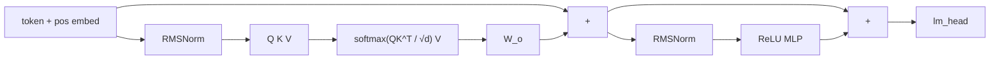

# Attention 基础：信息如何被路由

> 状态：published · 轨道：Transformers · 难度：L2 · 语言：Python / numpy

## 要解决什么问题

RNN / LSTM 把过去压进一个隐状态，这一步只能看「压缩后的记忆」。序列里每个位置怎样按需去「看」其他位置，而不是固定只看上一步？

## 直觉

Query / Key / Value：用相似度决定从哪里取信息。

| 角色 | 类比 |
|------|------|
| Query | 我在找什么 |
| Key | 我有什么可被找到 |
| Value | 找到之后取走的内容 |

因果 mask 保证位置 \(t\) 只能看 \(1..t\)（生成时不能偷看未来）。逐步吃 token 并缓存 K/V，和一张下三角权重表是同一件事。

## 本主题在训什么

| | 说明 |
|--|------|
| 数据 | Karpathy [makemore](https://github.com/karpathy/makemore) 人名（字符级） |
| 任务 | 下一个字符；`<EOS>` 包住姓名 |
| 网络 | 1 层、4 头、\(d=16\) 的最小 decoder GPT |
| 损失 | 逐步 NLL（`softmax` 后取目标 token 再 `-log`） |

## 网络长什么样

\[
\mathrm{Attention}(Q,K,V)=\mathrm{softmax}\!\left(\frac{QK^\top}{\sqrt{d}}+M\right)V
\]

\(M\) 把未来位置打到 \(-\infty\)。实现里是 **pre-norm** 块：\(x + \mathrm{Attn}(\mathrm{RMSNorm}(x))\)，再接 MLP。



细节见 [notes.md](./notes.md)。

## 目录

```
attention-basics/
├── README.md / notes.md / video.md / meta.yaml
└── code/
    └── micro_gpt.py   # Tensor 自动微分 + 最小 GPT
```

## 例子

人名上训最小 GPT，再采样。逐步 + KV cache 等价于因果 mask。

```bash
make run-attention                 # 首次下载 names.txt → data/
make run-attention STEPS=200
```

依赖：`numpy`（`python3 -c "import numpy"`）。默认 1000 步大约十几秒，loss 会往下走；采样是短的类姓名字符串（1 层玩具，不要当起名质量）。

## 局限与下一步

- 不覆盖：完整 nanoGPT、BPE、多卡、KV cache 系统实现（见 [推理优化](../../05-ai-infra/inference-optimization-101/)）
- 手写的是 numpy Tensor 自动微分，不是 PyTorch；框架对照见 [PyTorch 基础](../../03-frameworks/pytorch-basics/)
- 前置：[残差连接](../../01-classic-dl/residual-basics/)（block 默认 \(x+F(x)\)）；序列背景见 [LSTM](../../01-classic-dl/lstm-seq/) / [Seq2Seq](../../01-classic-dl/seq2seq-basics/)
- 下一站：[LLM 生命周期](../llm-lifecycle/) → [多模态](../multimodal-basics/) / [高效微调](../efficient-finetune/)
