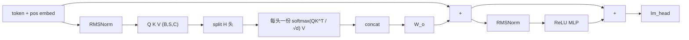

# Attention 基础：信息如何被路由

> 状态：published · 轨道：Transformers · 难度：L2 · 语言：Python / numpy（对照：PyTorch）

## 要解决什么问题

RNN / LSTM 把过去压进一个隐状态，这一步只能看「压缩后的记忆」。序列里每个位置怎样按需去「看」其他位置，而不是固定只看上一步？

## 直觉

Query / Key / Value：用相似度决定从哪里取信息。

| 角色 | 类比 |
|------|------|
| Query | 我在找什么 |
| Key | 我有什么可被找到 |
| Value | 找到之后取走的内容 |

因果 mask 保证位置 \(t\) 只能看 \(1..t\)（生成时不能偷看未来）。训练时整段一次算完再加这张下三角；推理逐步吐 token 是同一约束。

## 本主题在训什么

| | 说明 |
|--|------|
| 数据 | Karpathy [makemore](https://github.com/karpathy/makemore) 人名（字符级） |
| 任务 | 下一个字符；`<EOS>` 包住姓名 |
| 网络 | 1 层、4 头、\(d=16\) 的最小 decoder GPT |
| 训练 | batch=32；变长名字**右 padding** 成矩形，loss 忽略 pad |
| 损失 | 逐步 NLL（`softmax` 后取目标 token 再 `-log`） |

## 网络长什么样

\[
\mathrm{head}_i=\mathrm{softmax}\!\left(\frac{Q_iK_i^\top}{\sqrt{d}}+M\right)V_i,\quad
\mathrm{MultiHead}=\mathrm{Concat}(\mathrm{head}_1,\ldots,\mathrm{head}_H)\,W_O
\]

\(M\) 把未来位置打到 \(-\infty\)。\(Q/K/V\) 一次投影成 \(C=H\cdot d\)，再拆成 \(H\) 个头（这里 \(H=4,d=4\)）。实现里是 **pre-norm** 块：\(x + \mathrm{MHA}(\mathrm{RMSNorm}(x))\)，再接 MLP。



细节见 [notes.md](./notes.md)。

## 目录

```
attention-basics/
├── README.md / notes.md / video.md / meta.yaml
└── code/
    ├── micro_gpt.py         # 手写 Tensor 自动微分
    └── micro_gpt_torch.py   # 同一网络的 PyTorch 对照
```

## 例子

人名上训最小 GPT，再采样。变长序列右 padding；因果 mask 让真 token 看不到 pad。

```bash
make run-attention                 # numpy；首次下载 names.txt → data/
make run-attention-torch           # 同一超参的 PyTorch 对照
make run-attention STEPS=200
make run-attention BATCH=8 STEPS=50
```

依赖：`numpy`；torch 版另需 `pytorch`。默认 batch 32、1000 步；loss 会往下走，采样是短的类姓名字符串（1 层玩具，不要当起名质量）。

## 局限与下一步

- 不覆盖：BPE、生产级 KV cache（见 [推理优化](../../05-ai-infra/inference-optimization-101/)）。完整 nanoGPT + 多卡 DDP 见 [分布式训练 101](../../05-ai-infra/distributed-training-101/)
- 手写的是 numpy Tensor 自动微分；同目录 `micro_gpt_torch.py` 是 PyTorch 对照（不用 `nn.MultiheadAttention`）。框架课见 [PyTorch 基础](../../03-frameworks/pytorch-basics/)
- 前置：[残差连接](../../01-classic-dl/residual-basics/)（block 默认 \(x+F(x)\)）；序列背景见 [LSTM](../../01-classic-dl/lstm-seq/) / [Seq2Seq](../../01-classic-dl/seq2seq-basics/)
- 下一站：[LLM 生命周期](../llm-lifecycle/) → [多模态](../multimodal-basics/) / [高效微调](../efficient-finetune/)
