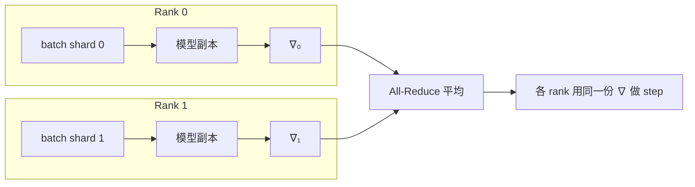

# 分布式训练 101：nanoGPT × DDP

> 状态：published · 轨道：AI Infra · 难度：L2 · 语言：Python / PyTorch

## 要解决什么问题

单卡装得下、但速度不够（或以后要换成多卡）时，多进程到底在 **分担什么**？数据并行最常见的直觉是什么？梯度日志里的 all-reduce 发生在哪一步？

本主题用 Karpathy [nanoGPT](https://github.com/karpathy/nanoGPT) 的 **字符级 Tiny Shakespeare** 当载体：同一套 GPT-2 风格网络，先单进程跑通，再用 `--nproc` / DDP 把大 batch 拆到多个进程。

## 直觉

把大 batch 拆到多个进程上算梯度，再 **平均** 后各自更新——模型每张卡一份完整副本，分担的是 **样本**，不是层。

| 谁在分担 | 数据并行（本主题） | 模型并行（只点名） |
|----------|-------------------|-------------------|
| 复制什么 | 整份模型 | 各拿一层 / 一块矩阵 |
| 通信什么 | 梯度 all-reduce | 激活 / 分片参数 |
| 适用 | 模型装得下、要加大 batch 或加速 | 单卡装不下模型 |

像多人分工算同一道题的不同样本，对完答案（平均梯度）再同时改同一份公式。



DDP 在 `loss.backward()` 里插入 all-reduce；你写的训练循环和单卡几乎一样。全局 batch = 每卡 batch × 累积步 × 进程数。

## 本主题在训什么

| | 说明 |
|--|------|
| 数据 | Tiny Shakespeare（约 1.1M 字符）；90/10 切成一条长 token 流 |
| 切块 | 随机抽 `(B, T)`，`y` 是 `x` 右移 1 位——nanoGPT 写法，**不用**人名那种 padding |
| 网络 | GPT-2 风格 decoder：LayerNorm + GELU + `c_attn` 一次出 QKV + embed/lm_head 权重共享 |
| demo（默认） | 4 层 / 4 头 / \(d=128\) / ctx=128 / 400 步，笔记本几分钟 |
| shakespeare | Karpathy `train_shakespeare_char.py`：6 层 / 6 头 / \(d=384\) / ctx=256 / 5000 步 |
| 分布式 | `--nproc N` 起 N 个进程，`DistributedDataParallel` 同步梯度 |

和 [Attention 基础](../../02-transformers/attention-basics/) 的玩具 GPT 对照：那边 1 层 \(d=16\) 人名 + 右 padding；这边是 nanoGPT 原结构 + 莎士比亚长流。细节见 [notes.md](./notes.md)。

## 目录

```
distributed-training-101/
├── README.md / notes.md / video.md / meta.yaml
└── code/
    ├── model.py    # GPT-2 decoder（nanoGPT 结构）
    └── train.py    # 数据 / 单进程 / DDP / 采样
```

## 例子

```bash
# 仓库根目录。首次下载 input.txt → topics/05-ai-infra/distributed-training-101/data/
make run-nanogpt                 # 单进程；自动 cuda / mps / cpu
make run-ddp                     # 2 进程 DDP（Mac 上 gloo+CPU；NVIDIA 上 nccl）
make run-nanogpt PRESET=shakespeare   # 完整 baby GPT，约 10M 参，5000 步
make run-nanogpt STEPS=50        # 冒烟
make run-nanogpt-sample          # 读 data/ckpt.pt 再采样
```

预期：`demo` 的 train loss 从 ~4（随机，vocab≈65）往 2 附近掉；采样是还能认出来的英文台词碎片，不是人名。`shakespeare` 预设会过拟合这块小语料（Karpathy 原文也这么说），val 先降后升是正常的。

依赖：`pytorch`。

设备：

- 单进程：`auto` 优先 CUDA，否则 MPS，否则 CPU
- DDP：CUDA 走 NCCL；没有 CUDA 时走 **gloo + CPU**（MPS 不参与进程组）。`make run-ddp` 用 `--nproc` 在本脚本里 spawn；也可以自己用 `torchrun`（会注入 `RANK`，脚本不会再 spawn 一层）。

## 局限与下一步

- 不覆盖：FSDP / ZeRO、张量并行、流水线并行、多机 `MASTER_ADDR`
- 本主题的 DDP 是「模型装得下」的数据并行；模型太大时才换模型并行 / 分片优化器
- 前置：[PyTorch 基础](../../03-frameworks/pytorch-basics/)（`nn` / autograd）；网络直觉见 [Attention 基础](../../02-transformers/attention-basics/)
- 下一站：[推理优化 101](../inference-optimization-101/)
